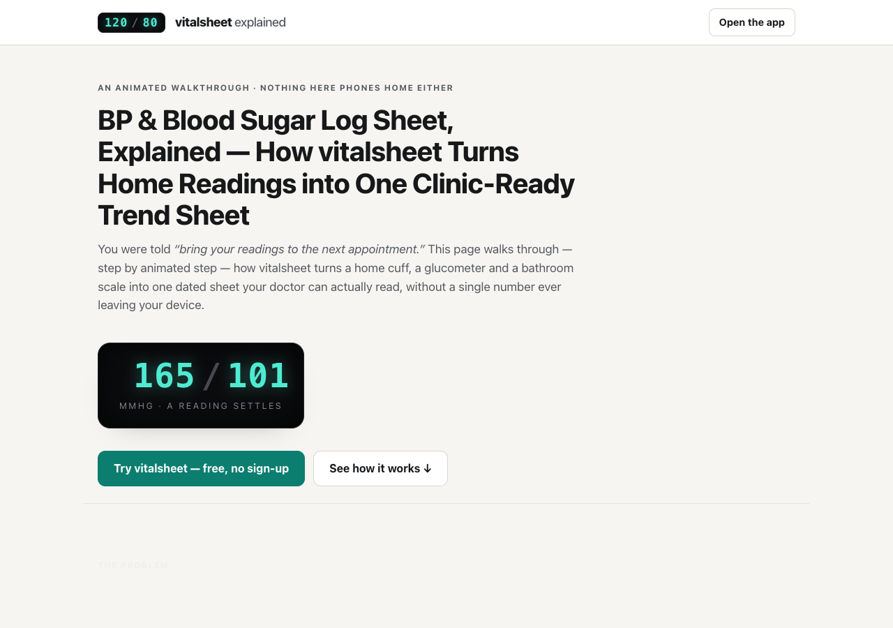

# vitalsheet explained

**An animated walkthrough of [vitalsheet](https://sreenivas-sadhu-prabhakara.github.io/vitalsheet/)
— the clinic-ready BP & blood sugar log sheet.** One scrolling page that shows, step by animated
step, how scattered home blood-pressure, glucose and weight readings become a dated trend sheet
with honest averages — and why a strict Content-Security-Policy makes "nothing leaves this device"
enforced by the browser rather than promised in a policy.

**→ Read it live: <https://sreenivas-sadhu-prabhakara.github.io/vitalsheet-explained/>**
**→ The app it explains: <https://sreenivas-sadhu-prabhakara.github.io/vitalsheet/>**



## What's on the page

- **The hook** — a seven-segment cuff readout (the vitalsheet motif) counts down and settles,
  then flows into a miniature trend sheet.
- **The problem** — "bring your readings" usually means a crumpled slip of paper and three
  phone notes nobody can read in a five-minute consult.
- **Step 1: log** — a device number becomes a dated, editable row in two taps.
- **Step 2: trend** — the animated table demo; the 7-day and 30-day averages shown are
  **computed live by the page** from the demo rows, with the same formulas the app uses
  (arithmetic mean, round half up; 7-day window = dates on or after asOf − 6 days).
- **Step 3: bands** — cited reference-band chips (2017 ACC/AHA categories, ADA target caveat,
  the 18.016 mg/dL→mmol/L factor) quoted verbatim with verified-on dates; out-of-range is
  marked ▲ + text, never colour alone.
- **Step 4: handoff** — the A4 print sheet animation and a typed RFC-4180 CSV row.
- **The guarantee** — a diagram of a reading being refused at the `connect-src 'none'` wall,
  next to the exact CSP both the app and this page ship.
- **Feature tour, honest limits, and a CTA** to open the app.

All animation is CSS + inline SVG only — no libraries, no canvas, no external assets.
`prefers-reduced-motion` collapses every animation to its final, fully legible static state.
Light and dark schemes are both WCAG-AA; the page is keyboard-operable with a skip link.

## Quickstart

Open `index.html` in any modern browser — no build step, no server, no install.
The self-tests re-derive every number the animations display:

```sh
node --test
```

They assert the BP classifier against the cited ACC/AHA fixtures (higher category wins), the
windowed averages (including month-boundary and leap-year window starts), the 18.016 glucose
conversion, RFC-4180 quoting, provenance on every stated fact, and that the CSP this page
*states* is the CSP it actually *ships*.

## Privacy

This explainer practises what it preaches: it ships the same strict CSP as the app
(`default-src 'self'; connect-src 'none'; …`), loads no external fonts, scripts, images or
analytics, and stores nothing. It cannot see you.

## Facts & sources

Every band, rule and factor stated on the page lives in `data/facts.js` with `source_title`,
`source_url` and `verified_on` (2026-07-23), mirroring the hand-verified corpus of the
vitalsheet app: AHA "Understanding Blood Pressure Readings"; Whelton et al., 2017 ACC/AHA
guideline; ADA Standards of Care "Glycemic Goals and Hypoglycemia"; NIH/NIDDK glucose
unit-conversion table. Nothing is fabricated.

## Disclaimer

This page and the vitalsheet app provide general informational logging and cited reference
bands for educational purposes only. **They are not a medical device, not medical advice, and
not a substitute for professional care.** They do not diagnose, interpret, or judge readings
and never answer "is this bad?". Reference bands are dated population guidelines (sources
verified 2026-07-23) and may not apply to you; always consult a qualified clinician about your
readings and targets. This software is provided under the MIT License, "as is", without
warranty of any kind; the author accepts no liability for any loss, injury, or damage arising
from its use.

## License

[MIT](./LICENSE) © 2026 Sreenivas Sadhu Prabhakara
